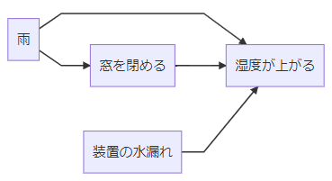

# ベイズ統計入門 Vol.2

---

## 原因の確率

A という結果が得られたときに原因が$H_1,H_2,\dots,H_n$が考えられるとする。
A が起こった時に原因が$H_i$である確率を$P(A|H_i)$と表する。

ベイズの定理でまとめると
$P(H_i|A) = \frac{P(H_i)P(A|H_i)} {\Sigma P(H_i) P(A|H_i)}$

---

$P(H_i|A) = \frac{P(H_i)P(A|H_i)} {\Sigma P(H_i) P(A|H_i)}$
図で表現すると以下の様になる(分母=赤,分子=網掛け)

---

ベイズの定理は可能性を絞り込む事で情報を引き出す
ベイズの定理: $P(A|B) = \frac{P(B|A)P(A)}{P(B)}$

---

現実では$P(原因)$は知ることができず、観測できるのは結果がほとんど
なので、原因ごとの結果の比率を足して$P(原因)$とする

$P(H_i|A) = \frac{P(H_i)P(A|H_i)} {\Sigma P(H_i) P(A|H_i)}$

重要なのは分子なので分母は無視して考えることが多い

$P(H_i|A) \propto P(H_i)P(A|H_i)$

---

$P(H_i|A) \propto P(H_i)P(A|H_i)$

日本語訳するなら

$事後に有する情報 = (事前に関する情報) * (標本の出方の情報)$

---

もう少し言い換えると

$事後確率(主観) = 事前確率(主観) * 観測された事実(客観)$

主観的な確率を客観的なデータで更新するプロセス
ベイズでは観測しえない情報など主観確率を通して取り扱える

---

## ベイズの定理とその周辺の歴史

---

トーマス・ベイズ(1702-1761)

定理の名前にもなっているが二項分布のケースしか扱っていない。
しかし、ベイズの哲学においてもっとも革新だったのは
何らかの値があるがわからない値はいろいろな値をというるという仮定、
つまり事前分布を置いたこと

---

ラプラス(1749-1827)

今の近代ベイズの定理を作り出し大規模な応用をした人
天文学における測定誤差の補正に確率論が必要だった
他にも出生率が男子の方が僅かに高い(0.52)ということを突き止めて
1812 年には「人類にとって一般的な法則だと思われる」と語った

---

ロナルド・フィッシャー(1890-1962)

土壌試験場での化成肥料の分析の仕事を通じて確率論を利用
特にランダムサンプリングや最尤推定、客観的な情報を集めるという手法を確立。

繰り返し実験ができる環境における理論体系を立ち上げた

ベイズの**事前確率という主観的な値**を使うことに強く反対した

---

ベイズの現在

- 主観確率の批判はあるものの十分にデータがあれば
  客観的な解析と同じ結果に収束する
- 客観的な情報が得にくい状況下においては有用であるため、
  リスクや信頼度、意思決定の分野で活用されている

---

## ナイーブベイズ

ベイズの定理を使って原因を評価する

---

壺のモデル

外見では違いが分からないが、中身の分かっている壺が 3 つある
壺を選び玉を取り出して、選んだ壺が ABC のどれかを当てたい

---

| 玉個数\壺 | 壺 A | 壺 B | 壺 C |
| :-------- | :--- | :--- | :--- |
| 赤        | 3    | 1    | 2    |
| 白        | 1    | 4    | 2    |
| A         | 1    | 0    | 0    |
| B         | 0    | 1    | 0    |
| C         | 0    | 0    | 1    |

---

壺どれが選ばれているかわからない。
だから均等な確率として 1/3 を置く。

$\frac{18}{35} = \frac{壺Aは\frac{1}{3} * 壺Aから赤玉がでる確率は\frac{3}{5}}{壺ABCそれぞれから赤玉が出る確率の和}$

他の壺よりも A である可能性がもっともらしい
しかし十分に確からしいとは言えない。

---

### ベイズ更新

ひとつ前の事後結果を次の計算の事前結果として使う。
何もわからないときは A の確率が 1/3
ひとつ前で赤が出たので 18/35
次も赤が出たなら?

---

シミュレーション例

---

ベイジアンフィルター(スパムメールフィルター)も同じ仕組み

1. 全体 = データ元となるメールすべて
1. 壺 = カテゴリ(スパムかどうか)
1. 玉 = 使われているワード

---

### データベース

自身のメールから壺の例のようなデータを作る

$ワードの出現率 = \frac{あるカテゴリにワードが含まれる数}{あるカテゴリのデータ数}$

| x          | スパム | ハム |
| :--------- | :----- | :--- |
| 100 万円   | 2      | 0    |
| 当たり     | 4      | 6    |
| プレゼント | 3      | 1    |
| 全体       | 1000   | 3000 |

---

### 予測

届いたメールに以下のワードが含まれていた

1. 100 万円
1. プレゼント
1. 当たり

- スパム $\frac{1}{2} * \frac{2}{1000} * \frac{4}{1000} * \frac{3}{1000}$
- ハム $\frac{1}{2} * \frac{0}{1000} * \frac{4}{1000} * \frac{1}{1000}$

母数の計算を省いて分子だけで比較。スパムの可能性が高い

---

単語の出現確率 -> 観測可能な尤度
カテゴリの事前確率 -> 主観確率

文章中の単語の出現率から、どちらのカテゴリが尤もらしいかを考える

1964 年 The Federalist Papers の著者推定で用いられた手法

---

### 特徴と課題

1. 計算負荷は小さい -> 事前確率 + ワード数 n の掛け算
1. 母数は計算せず、候補どうしの確率の比(Odds)で評価出来る
1. 切り出したワードがカテゴリ内になければ確率 0 になる
   -> 0 にならないような補正(スムージング)を入れることが多い
1. そのまま計算すると桁が小さくなりすぎる
   -> 対数で計算
1. 単語が独立であるということを仮定している
   現実はそうではないので結果に乖離はある

---

ちなみに The Federalist Papaers は推定される二人の著者の論文や文書から明らかに差があるという単語の使い方を見つけ出すことで可能になった

| 単語   | ハミルトン          | マディソン    |
| :----- | :------------------ | :------------ |
| while  | 使う                | whilst を使う |
| upon   | 1 論文中 2 回の頻度 | 使わない      |
| enough | 使う                | 使わない      |

そのほか「there」「on」「may」「his」などの単語が指標として使われた

-> 目的に合った構成にするのは大切

---

## 医療での実用例

- 検診: 原因の早期発見
- 診察: 不調の原因推定

---

検診の課題

1. がんなどは早期に発見したい: 健康促進
1. 試験には偽陽性があり患者の精神面、費用面での負担がある
   がんかもしれない -> 違いました
1. 検診で検査するのは不利益を上回る利益があるものにしたい
1. 検査陽性で実際にがんである確率、すなわち**陽性反応的中度**が重要指標

---

臨床では 2x2 分割表を作る

| 結果\疾病 | 有り         | 無し         | 計      |
| :-------- | :----------- | :----------- | ------- |
| 陽性      | a:真陽性(TP) | b:偽陽性(FP) | a+b     |
| 陰性      | c:偽陰性(FN) | d:真陰性(TN) | c+d     |
| 計        | a+c          | b+d          | a+b+c+d |

- 精度: $\frac{a}{a+c}$
- 特異度: $\frac{d}{b+d}$
- 陽性反応的中度: $\frac{a}{a+b}$

---

臨床データ例: 久道茂、西田博
大腸がんの潜血テスト

---

### 大腸がん検診のプログラム

1. 検査方法はいろいろあるが大規模検診にはコストと精度で便潜血検査(FOBT)の免疫、2 日法が良い
1. 大規模 FOBT では精度と特異度が十分でないため的中度が低い
   - 無症状期間が 5-7 年あるのでこの間に捕まえればよい
   - あえて精度を下げる(0.7 -> 0.45) -> 特異度が上がる(0.87->0.97)
   - 精度が低い場合でも、がんなら 5 回すべてで陰性になる率は低い(5%)
   - 5 年間の間に一度でも陽性になったら、大腸内視鏡で精密検査
   - 大腸内視鏡: 感度 95%、 特異度:100%

---

### 質問による診察

疾病した人の症候のデータは観察できる
-> 条件付き確率 P(症状|疾病)

右は COVID-19 の症例

> 新型コロナウイルスの Now 12 月 18 日版
> 公立陶生病院 感染症内科の武藤義和先生

診察では症候(結果)から疾病(原因)を推定する

---

- $P(D_i)$: よくある疾病はどれか
- $P(S_i | D_i)$: ある疾病の時にその症状がでる確率

それをまとめたのが疾病-症候行列
| x | $P(D_i)$ | $P(S_1 \| D_i)$ | $P(S_2 \| D_i)$ | $P(S_3 \| D_i)$ |
| :---- | :------- | :-------------- | :-------------- | :-------------- |
| $D_1$ | 0.23 | 0.1 | 0.7 | 0.6 |
| $D_2$ | 0.77 | 0.8 | 0.2 | 0.5 |

---

実際に症状 S1 と S3 があったとする $S=(1,0,1)$
事後確率を求める $P(D_1|1,0,1) = \frac{P(D_1) * P(S_1|D_1) * (1 - P(S_2|D_1)) * P(S_3|D_1)}{P(D_1) * P(S_1|D_1) * (1 - P(S_2|D_1))* P(S_3|D_1) + P(D_2) * P(S_1|D_2) * (1 - P(S_2|D_2) * P(S_3|D_2)} = 0.16$

---

場合別計算の例

---

## ベイジアンネットワーク

人の持つ確信の度合いを科学的に扱うための有効非巡回グラフ

---

湿度が高い時にその原因が何と考える?

---

降水確率 $P(R)$

| 雨が降る(T) | 雨が降らない(F) |
| :---------- | :-------------- |
| 0.3         | 0.7             |

雨の時に窓を閉める確率(尤度)$P(W|R)$

| 雨=R            | 窓を閉める(T) | 閉めない(F) |
| :-------------- | :------------ | :---------- |
| 雨が降る(T)     | 0.7           | 0.3         |
| 雨が降らない(T) | 0.05          | 0.95        |

---

湿度が高い時に雨が降っている確率

---

水を大量に使う装置を使っている

水漏れしている確率$P(W)$

| 水漏れしてる(T) | してない(F) |
| :-------------- | :---------- |
| 0.02            | 0.98        |

---

それぞれの原因のときに湿度が高い時確率(尤度)$P(H|W,R,M)$

---

雨や窓閉の確率は変わっていないが、
装置の有無とその結果(前提)が変わったことで、推測が変化する

---

まとめ

- **主観**を**客観**で更新する
- ベイズの哲学は人間の推測の形に近い
- 暗黙知や直感を書き出すことでより活用できる

---

次回

- 確率分布
- ベイズ決定
- 線形回帰

---

### 参考書籍

- 『異端の統計学ベイズ』著: シャロン・バーチュ・マグレイン
- 『入門ベイズ統計 意思決定の理論と発展』著: 松原望

---

### 参照 webpage

- [損保総研レポート](http://www.sonposoken.or.jp/media/reports/sonposokenreport083_2.pdf)
- [新型コロナウイルスの Now!!!](https://www.covid19-taskforce.jp/category/opened/)
