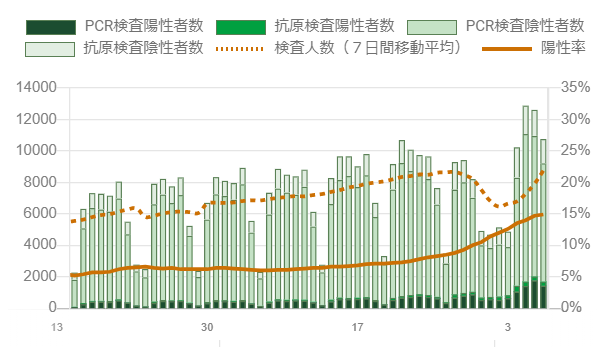

# ベイズ統計入門 Vol.1 第 2 版

---

## Topic

- 確率について
- ベイズの考え方の触り

---

### あなたは裏路地の薄暗い酒場に入った

あなたは明日に訪れるであろう恐ろしい存在を思い出す
なんとしてもお金を増やさなければならない

---

近くのテーブルではコイントスのゲームをしているようだ

1. 1 回投げて表だったら掛け金の 2 倍
1. 4 回投げてすべて表なら掛け金の 10 倍
1. 1 つの 6 面サイコロで出た目が 2 以下なら 2 倍

それ以外の場合に掛け金は没収される
勝つためにはどれを選ぶのが良いだろうか?

---

### 確率

確率とは **試行(trial)** によって得られた **事象(event)** の割合で表現される
**偶然起こる事象の起こりやすさの指標**

1. コインは **表**か**裏**のふたつしか出ない。
   表になる確率は $\frac{表}{表、裏} = \frac{1}{2}$
1. コイン 4 回ですべて表なら$\frac{1}{2^4} = \frac{1}{16}$
1. 6 面サイコロで特定の目 $\frac{1}{6}$
1. 6 面サイコロで 2 以下 $\frac{2}{6}$

---

面積の表現

---

確率について

1. コインが表になる確率は $\frac{1}{2}$
1. 6 面サイコロで特定の目 $\frac{1}{6}$

じゃあ

1. PCR 検査で陽性になる率は $\frac{陽性}{陽性、陰性} = \frac{1}{2}$ ... :thinking:

---

すべての事象の起こりやすさが均等という仮定していた。
実際には **起こってみないとわからない**

-> 測定して統計を取ってみる

---

東京都が発表した 2020/01/08 の新型コロナウィルスの PCR 検査の情報

$\frac{陽性判定数}{検査数} = \frac{1425}{8746} \fallingdotseq 0.16$

---

平均: $\frac{1425}{8746} \fallingdotseq 0.16$
標準偏差: $((1-0.16)^2 * 1425) + (0-0.16)^2 * (8746 - 1425)) / 8746 = 0.13$

検査は 100%の精度ではない(偶然性がある)

---

最尤法 = もっともらしいのはどれか

原因 --> 結果の流れの逆を行くから **逆確率**
真の陽性率(知ることが出来ない) --> 観測結果陽性率$0.16$(試行で観測できる)

たぶん真の陽性率は$0.16$だろう

---

コインも完全に正確ではないし偶然に絶対はない。
世の中のコインは 0.5 かもしれないが、今ここにあるコインがそうとは限らない
**勝ちたいから、勝てるゲームを選ぶ**

---

酒場を見渡すとフードの二人組が何やら話し合っているのが見えた
あなたはこういうのを盗み聞くのが得意だった

このフードたちは各テーブルの結果を数えているらしく次の情報が得られた

| テーブル | 表の回数 | 裏の回数 |
| :------- | :------- | :------- |
| A        | 60       | 40       |
| B        | 50       | 50       |
| C        | 40       | 60       |

---

1 回表が出て 2 倍になるゲームの期待値

- A $コインの表率 = \frac{60}{60+40} = 0.6$ -> 期待値 $1.2$
- B $コインの表率 = \frac{50}{50+50} = 0.5$ -> 期待値 $1.0$
- C $コインの表率 = \frac{40}{40+60} = 0.4$ -> 期待値 $0.8$

テーブル A のゲームは表率が高い -> あのコインは表が出やすい

---

20 回ほどゲームをしたが僅かに負けている。
裏が続いていてそろそろ出るはずだ、男は思い切って全額を賭けることにした。
その時ディーラーの口元がゆがんだ気がした...

---

PCR 検査の例

$0.16$の意味とは?日本でコロナ感染している比率...ではないし検査の精度でもない。
そもそも下記のように変化している。

`事前のスクリーニング --> 疑わしい患者 --> 検査 --> 結果`

---

陽性率の変化は検査の結果を支配するパラメータが変わっている事を示す

1. 全ての患者
1. 検査前のスクリーニング
1. 検査方法

感染対策は仮説を立てて検証することで
どれが原因かを絞りこみ、個別の対策をすることになる

---

先ほどのコインのゲームの例はモデルを読み間違えたのが敗因
コインの表率が操作されているという要素を見落とした

- 誤 `コインの表率`
- 正 `ディーラーによる操作 --> コインの表率`

**このゲームがイカサマされている確率**を考えていれば...

---

ベイズの強み

1. 不確定性を含むもの
1. 再現が困難なこと

応用例

1. 病気や事故の原因推定
1. 意思決定

---

### 実例 1

スペースシャトル チャレンジャー号の事故

1. 低温で男性率が下がる事が知られていた
1. 事故にならなかったが以前から O-Ring の破損は起きていた
1. O-Ring の破損は気温が低い時に起きていた
1. 当日の気温は低かった

---

### 実例 2

医療における関連性の推定。例えばたばこと肺がんの関連性とか

1. 慎重に対象群を選んで統計比較
1. 無限にある可能性の内、いくつかの要因を点数化して比較

---

### 実例 3

まだ一度も事故が起きていない原発事故の予測。原発の事故

1. 構成される部品ごとの故障率から予測される、ある期間に起きる事故の数
1. 起こりうる災害の規模とその頻度
1. 確率が低くても十分な試行回数(期間)があればそれは起こると考える

---

まとめ

- 確率
- 最尤法による推定
- ベイジアンネットワークの触り

---

次回

- ベイズの定理実用編
- ベイジアンネットワーク
