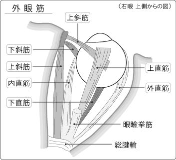
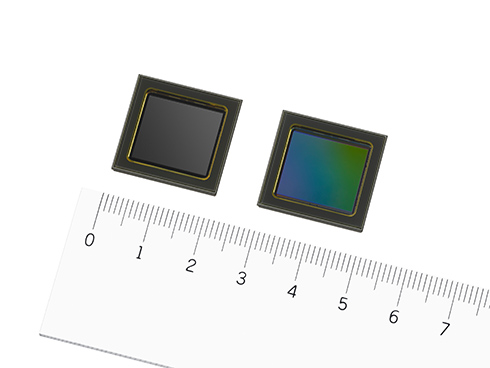
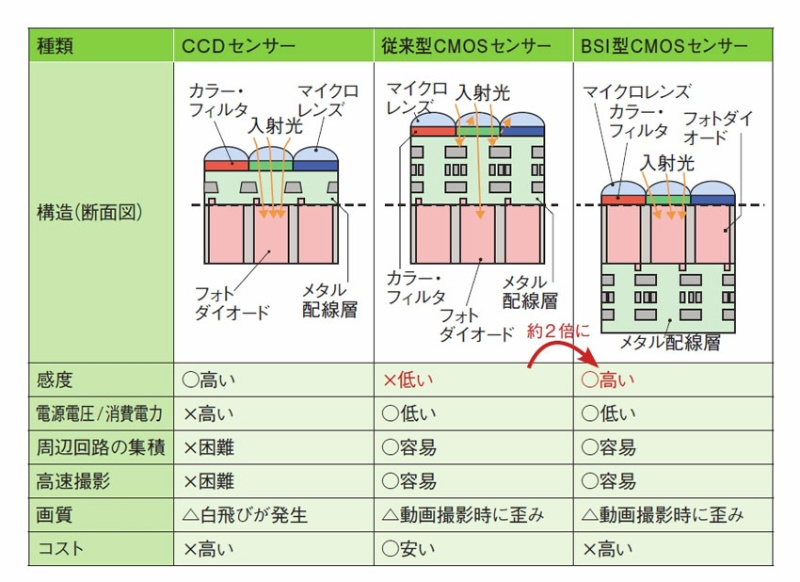
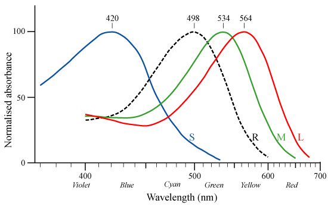
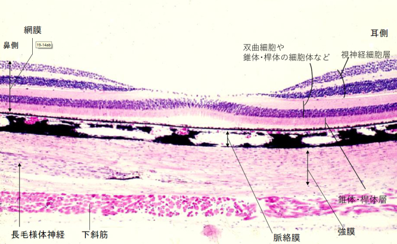
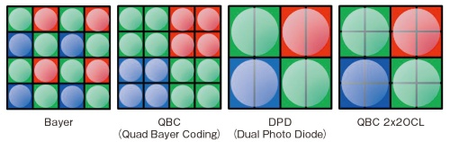

# 人は何を見ているのか(光受容体編)

---

カメラと眼の違い

1. 光学系
1. 像面
1. 前処理

---

## 光学系

光を屈折させて像面に集めるのが光学系の役目
どの範囲を見るかは画角=視野角で表される

> Human Factors for Desiners of Naval Equipment, 1971 より

---

片目の全範囲=150°程度 -> 35mmサイズ換算すると10mm程度になる
TAMRON SP 15-35mmレンズの断面図

> TAMRONの製品紹介より

ざっくり凹レンズで光を並行にして、凸でフィルム上に落とす
中央部のレンズ群が焦点距離、フォーカス調整の機構

---

眼の平面図

> 神戸学院大学 組織学カラースライドより

角膜が凹レンズ、焦点調整は凸レンズ様の水晶体

---

| 項目     | レンズ                 | 眼                           |
| :------- | :--------------------- | :--------------------------- |
| 屈折率   | 空気(1.0), ガラス(1.5) | 空気, 水分(1.3), 水晶体(1.4) |
| 光学系   | 対称                   | 非対称(視軸と光軸が違う)     |
| 投影面   | 平面(35x24mm)          | 球面(r=12mm)                 |
| 焦点調整 | レンズ間の距離を変える | 水晶体の厚みがかわる         |

---

屈折率の差はレンズ構成と反射に影響
空気(1.0) -> 光学系(角膜(1.3)やガラスレンズ(1.5))

- カメラレンズ
  - 反射防止コーティングで反射を防ぐ
  - 暗い鏡筒でゴーストを防ぐ
  - 空気とは屈折率差が大きいのであまり角度が付けられない
- 眼
  - TearFilm。角膜表面の保護+均質度向上のために常に濡れている
  - 水晶体の前は前房とよび前房水で満ちている
  - 眼は水風船的な構造。硝子体というゲル状の物で満ちている
  - 眼全域に栄養を送り続けるために血管が各所にある

---

光学系の対称性

カメラは均一である事を求められる
中央がよく映り、なおかつ周辺もそれに倣うように設計されている

眼は"中心窩"と呼ばれる解像度の高い場所が少し耳側にずれて存在する
カメラ以上に中心窩が良く映ればよいという設計

---

投影面

カメラは平面なので光線を並行にする必要がある

眼は球面なので光線の屈折量が少なくて済む

---

焦点調整

レンズは剛体なので鏡筒が動くことで距離を調整し、焦点の調整を行う

水晶体は弾性があり、周囲の筋肉の力を抜くと弾力によって縮む
必然的に凸の曲率が上がるため焦点距離が短くなる = 近くが見える

> 神戸学院大学 組織学カラースライドより

---

眼球運動
直接光学系ではないが、眼球そのものを動かすことで視線を変えられる。

> メガネの服部より

---

### 像面

導いた光は何らかの形で解釈可能な信号にする必要がある
イメージセンサや網膜などで光から電気へ変換をすることで利用可能になる

---

#### CMOSイメージセンサー

現在主流のセンサー

1. 光がPD(フォトダイオード)に入射
1. 光起電力効果などで半導体内領域により電荷が移動する
1. キャパシタに電荷を貯める
1. 電荷読み出し(ここがCMOS)
1. 電荷 -> 電圧 -> AD変換

---

制約と工夫

- 画素(PD、読み出し回路を含めた一組)の大きさ
  - 小さい -> 解像度が上がる
  - 大きい -> 電荷のレンジが増える
- IRフィルターとカラーフィルター
  - 可視光外をカットする
  - 特定の波長の情報だけを変換する(RGB)
- 時間
  - 露光時間
  - 転送時間

---

CCDとかCMOSとかの小話
FT-CCD: (受光部+蓄積部)兼伝送路: メカシャッターが必要
IT-CCD: 受光部+伝送路: 電子シャッター(グローバルシャッター)
CMOS: 受光部+読み出し回路: 電子シャッターに時間差が出来る
センサー画素断面図

> xTECHより

---

#### 網膜

眼底にある薄い膜が網膜

1. 錐体と桿体の2種類が光を受容
1. 神経パルスがアマクリン、双曲、水平細胞で処理
1. 視神経を伝って視交差を経て外側膝状体(LGN)へ

---

網膜断面図
錐体、桿体は最下層にある=外側から血液を供給する
視神経は内側にある -> 盲点で外に出ている

---

細胞の感度の違い
ピークの波長と感度が異なる

- 錐体: 昼間に使いやすい感度。Cone形状なので錐体
- 桿体: 夜間に使いやすい感度。Rod形状なので桿体

---

錐体の色の違い

人間の場合はRGBに対応する3種類の錐体を持つ
プルキンエ現象: 昼は赤、夜は青の方が明るく見える

> [図はwikipediaから引用](https://ja.wikipedia.org/wiki/%E9%8C%90%E4%BD%93%E7%B4%B0%E8%83%9E)

---

中心窩
視力の最も良い場所
桿体はなく、錐体だけで光学的に邪魔になる視神経などは周辺に押しやられている

---

比較

| 項目           | イメージセンサ(IMX472) | 網膜                        |
| :------------- | :--------------------- | :-------------------------- |
| 受光面積(mm2)  | 338(平面)              | およそ900(球面内壁)         |
| 画素数         | 12M                    | 120M(桿体) + 6.5M(錐体)     |
| 画素配置       | Quad bayer             | 中央優先                    |
| 画素サイズ(μm) | 3.75                   | 1.5-5                       |
| 入力チャネル   | 3(RGB)                 | 4(RGBV)                     |
| 出力           | 12M                    | 1.2M?(視神経)               |
| 出力チャネル   | 3(RGB)                 | 2(On/Off)\*3(V,r-g, y-b)    |
| 信号変換       | Charge(電荷の時間積算) | Counting?(パルスストリーム) |

---

#### 解像力

視力1.0 = 1分のスキマが識別できる
1分を網膜に投影すると$rad(\frac{1}{60})*17mm = 4.9 \mu m$
錐体の大きさは中心窩で1.5㎛、他では5㎛と言われているので視力2.0程度が上限となる。

CMOSは全体が均一なのでレンズ性能次第

| 項目               | 画素を小さく | 大きく       |
| :----------------- | :----------- | :----------- |
| 解像度             | 上がる       | 下がる       |
| ダイナミックレンジ | 下がる       | 上がる       |
| コスト             | 上がりにくい | 大きく上がる |

---

半導体メモ

1. 製造はウェハ単位
1. ウェハの面積は有限(300mm)
1. チップ形状も限定的(矩形)
1. 露光面積にも上限(33mm\*26mm)

- 素子を小さく
  - チップ数が多い。無駄な面積が小さい
  - 寸法当たりのばらつきが大きくなる=ノイズ大
- 面積を大きく
  - チップ数が少ない
  - チップ当たりの欠陥発生率が高くなる
  - 35mm 露光パターンがshotサイズを超える

---

#### 色(錐体)

錐体の分布
同時に複数の色は取れないのでややランダムに分布している

> The arrangement of the three cone classes in the living human eye より

---

#### 色(イメージセンサ)

RGBが1:2:1の面積比になる規則的な配置
配置が周期的な故の弱点もあり各社工夫をしている

> 日経xTECHより

---

#### 感度(桿体・錐体)

地球上で体感できる光量の差は8桁にもなる

- 晴天: 10^5 lx
- 雨天: 10^3 lx
- 街灯のある町: 10^1 lx
- 月の出ている夜: 10^-1 lx
- 三日月の夜: 10^-2 lx
- 新月の星明かり: 10^3 lx

---

感度調整

- 瞳孔(瞳孔径2-8mm = 10^1)
- 錐体・桿体切り替え(10^4)
- 前処理(後述)

桿体は1光子でも反応する

---

#### 感度(イメージセンサー)

上限は飽和電荷量(=画素面積)で決まっており、AD変換(14bit≒10^4)で数値化される

露光時間(s), 絞り量(F), 増幅量(ISO)で適切な画を作る

---

### 前処理

光を信号に変えることはできた
ところがそれを使う側が解釈可能な信号にしなければならない

消費者

- 眼 -> 視覚野
- イメージセンサ -> イメージフォーマット

---

#### イメージセンサ

1. 素子ノイズ補正
1. デモザイク

素子個体差のノイズや熱によるランダムノイズが常にある。
撮影前と後でノイズを取り信号だけを取り出すCDS(相関二重サンプリング)が主流

撮影したデータは12-14bitの配列。
これをカラーフィルターの配置を考慮して解釈しRGB(24bit color)配列に直す。
この過程で偽色やモアレ(画素周期と対象物の周期でうねりができる)

---

モアレ

> 光学ローパスフィルタを不要とするディジタルカメラシステムとモアレ低減技術 より

---

#### 網膜

1億2600万の受容器の情報を120万本の視神経に流し込む

アマクリン、水平、双曲細胞にて複数の桿体が1つの視神経に束ねられている

- 中心窩: 1錐体:1視神経
- 中心窩 -> 周辺: 1~1000桿体:1視神経

カブトガニの視神経などの実験から、神経パルスは高々100Hzである。

---

##### 網膜中心優先

視神経から先のV1で網膜座標関係は維持されている事は分かっている。
網膜上の位置をV1へマッピングすると以下の通り
ここでも網膜中心が面積のほとんどを占める

---

##### 暗順応

錐体桿体が自動で切り替わることが感度の曲線からわかる
明るい時には錐体、暗くなると桿体が主体になる

---

##### 受容野の変化

桿体の性能は変わらないので
信号の束ね方によって感度を調整する

---

##### 側抑制(On/Off)

側抑制、隣接する受容体のシグナルを抑制する傾向がある。
そのパターンを分類するとOn/Off型の2パターンがある

---

##### 色

錐体はRGBだが出力は少し違う
ヒトは補色を感じる 青<->黄色, 赤<->緑
これらは網膜信号時点で作られている可能性が高い

---

##### その他

分かっていないことも多い

眼球運動の制御は前頭葉で行っているようなので何かしらの情報があるはず。
上丘に向かって投射があるのは分かっている。

光感受性の制御もしてる?
瞳孔の制御は距離推定か光量のどちらが支配的なのだろう?

---

### まとめ

イメージセンサも網膜も高度な前処理がなされている
いずれも多様な環境変化に対応するため

- 彩色(だからRGBで近く可能な色が表現できる)
- 輪郭検出(じつは動き検知も?)
- 光学補正情報(焦点/絞りとか)

---

### 感想

- 画像処理をRGBでやるの目的にあってる?
- センサーの優秀さも必要だが、複数センサーや信号を統合する処理がかなり重要

---

### Reference

- [神戸学院解剖学カラースライド](http://db.kobegakuin.ac.jp/kaibo/his_db/index.html)
- [暗所視と明所視の分子メカニズム](https://www.jstage.jst.go.jp/article/hikakuseiriseika/34/3/34_70/_pdf/-char/ja)
- [眼は何を視ているか](https://www.amazon.co.jp/dp/4582546080)
- [画像処理システム論](http://www.indsys.chuo-u.ac.jp/~kato/IPS06/IPS-060921a.pdf)
- [眼の光学的機構](https://www.jstage.jst.go.jp/article/jjspe1933/27/322/27_322_750/_pdf)
- [鳥類の視覚受容機構](https://www.jstage.jst.go.jp/article/sobim/31/3/31_3_143/_pdf)
