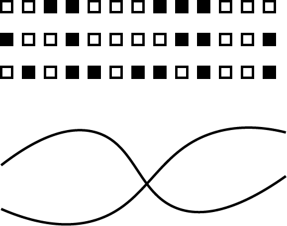

# 人は何を見ているのか(認知機能概要編)

---

背景

- 画像認識の技術は向上しているが、認識のぱたつきが大きい
  - 未検知だけでなく分裂や、認識<->誤認識の行き来などが起こりうる
- 現実は画像認識のテストケースよりも悪い撮影環境がありえる
  - それでもロボットは意思決定をしなければならない
- ロボットの眼の悪さを知っておきたい
- 生き物の眼が何を見ているのか知っておきたい

---

> 僕は自分の目で見たものしか信じない。
> 詠み人多数

自分の目が信じられるかどうやって知れば良いだろう?

---

## アジェンダ

1. 光と眼
1. 認知の世界
1. 記憶を見る

---

## 光と眼

> 神は言われた。
> 「光りあれ。」
> こうして光があった。神は光を見て、良しとされた。神は光と闇を分け、光を昼と呼び、闇を夜と呼ばれた。
> --旧約聖書・創世記--

---

> みる【見る／▽ 視る／▽ 観る】

1. 目で事物の存在などをとらえる
   (以下省略)

見るという行為は目を通して行われる。
目という感覚器は光を感知する。

---

### 光の性質

1. 光速で伝わる
   -> 早い
1. 媒体を必要としない(真空中も伝わる)
   -> 遠くまで伝わる
1. 物質と干渉、吸収、屈折、散乱、回折、反射などの作用が起こる
   -> 反射するから物が写る、吸収するから見ることができる
1. 波長によって相互作用が異なる

---

光は電磁波のごく一部の領域。
可視光は[380,780]nmという範囲。人間には波長が長い側が赤く、短いほうが紫に見える。

> 画像は wikipedia から

---

### 眼の構造

世界はあらゆる方向から光が来ている。
単純に光を感知するだけでは、すりガラス越しや眼を瞑ったりすると全体が明るいとか暗いといった程度のことしかわからない。

---

先の原始的な眼は像を結ばず一定方向の明るさしかわからない

> イソツルヒゲゴカイの幼生の眼
> 出典: [Mechanism of phototaxis in marine zooplankton](https://www.nature.com/articles/nature07590)

---

脊椎動物群で採用率の高いのはカメラ眼
カメラはまさにこのカメラ眼を模した構造

> 出典: [日本カメラ博物館](https://www.jcii-cameramuseum.jp/kids/2005/01/01/7570/)

---

特定の方向から来る光だけを受光し、全体を再構成すると今見ているような絵が見える。
どれくらい細かく見ることができるか -> 分解能と言われる
視力1.0で視角1分($\frac{1}{360} * \frac{1}{60}$)の切れ目が見える

---

ではイソツルヒゲゴカイの眼は役に立たないのか?
そんなことは無い。眼は筋肉につながっており、光を受けた側の筋肉の動く速度が遅くなる。
光の差す方に方向転換している = 走光性という。

---

眼は外界を知るための感覚器、見ることで得られる効用のために進化してきた。
イソツルヒゲゴカイは光の方向を知るため。
人間は世界を見るために目を持っている。

---

### 認知の世界

---

人がどのように光を見ているかは分かった
次は人がその情報をどのように知覚しているかを知る
カメラで撮った画は小さな色のピクセルが集まったもの
ピクセル自体には何の意味もない
しかし私たちはその絵を見て"何であるか"を考えることができる
単なるピクセルの集合"ではない"とらえかたをしている

---

視覚情報には少なくとも3つの経路があることが分かっている

1. 形/色の経路
1. 場所/構造の経路
1. 運動の経路

---

今回は以下の3つの視点からみる

1. 形/空間をとらえる
1. 色をとらえる
1. 動きをとらえる

---

#### 形をとらえる

物体をとらえるには境界を見つけて、周囲と分離する必要がある
形を「まとまり」で捉えようとする働きによって実現されている
どのように「まとまり」を捉えるかについて見ていく

---

##### ゲシュタルトの法則

ものを「まとまり」や「グループ」として認識・知覚する傾向

1. 近接の法則: 近いものはまとまりやすい
2. 閉合の法則: 閉じた領域はまとまりやすい

---

3. 類同: 類似した物がまとまりやすい
4. 良い形の法則: 単純な、規則的な形はまとまりやすい
5. 連続の法則: なめらかに繋がるものはまとまりやすい

---

上記のように瞬時に形を認識しまとまりを知覚する
腹側神経路とよばれる「what」を推定する経路があるという説が挙げられている。
形というものに対して自動的に何らかの知覚が働く
それを体感出来る形の錯視がある

---

長さの錯視(ミュラー・リヤー錯視)

---

方位の錯覚ツェルナー錯視

---

渦巻き錯視
部分的な傾きを持って全体を知覚してしまうため、渦巻きに見えると考えられている

> [北岡明佳:渦巻き錯視](http://www.psy.ritsumei.ac.jp/~akitaoka/uzu4.html)

---

存在しない三角形が見える
主観的輪郭線

---

直線が曲がって見える(ヘリング錯視)
眼で見ると3次元的空間で把握するときにはこのように歪みがある
空間視もしくは動体視による錯覚と考えられている

---

人間の顔が瞬時に識別できて、他の動物の顔は良く分からない
人間の顔、表情の識別に特化した回路を持っている

---

#### 色をとらえる

太陽の光、月明かり、照明、影が落ちた場合など様々な照明条件があり
光の強さも含まれる波長も桁違いの差がある
それでも壁や床は連続しているように見えるし、同じ色に見えている
色や明るさは認識の影響を特に強く受ける

---

明るさの錯視(明るさの恒常性)

> 出典:[錯視の世界へようこそ](http://xn--psy-0u8ii01b.ritsumei.ac.jp/~akitaoka/JAGDA2016.html)

---

色の錯視(ムンカー錯視)
色の同化によって別の色に見える

---

顔色を見ることができる
肌色が良い悪いという僅かな差に気が付ける
肌を通して見える血の色(血流の量、酸素飽和度)を見ることができる

---

#### 動きをとらえる

目の情報が脳に届いて知覚するまで0.1秒はかかる
更に投げられたボールを受け取るためにはそれを予想して動かなければならない
動きをとらえるための特別な領域を脳は持っている

---

閃光遅延効果
仮説はふたつ

1. 位置を先取りして認知している
1. 突然現れる物体よりも移動体の方が早く処理される
   > ヒトの目、驚異の進化より
   > 

---

オーバーシュート錯視

---

移動の錯覚
視覚的なボケを移動していると認識する

> [錯視の世界へようこそ](http://xn--psy-0u8ii01b.ritsumei.ac.jp/~akitaoka/JAGDA2016.html)

---

## 記憶を見る

---

私たちは見たものが何であるか
自分にとってどのような意味があるかも見ている

---

情動記憶

- 虫を見た時に嫌な"感じがする"
- 怒っている人間の表情をみて身体がこわばる

見たものを知るだけにとどまらず、過去の経験や遺伝的な条件をもとに何らかの情動が生み出され、行動につながる

---

視覚イメージ
見たモノを思い浮かべたり、違和感に気が付ける
眼からの入力が無くても映像を見たような気になる

記憶から感覚を生み出すフィードバックがある

---

何が変わったかわからないけど何かが違う

視覚イメージと実際の入力との差分に気が付く -> 幅広くある直観といわれるもの

---

記憶の錯覚というのは多岐にわたる

1. 注意の錯覚。注意したものしか記憶できない
1. 記憶の錯覚。「本当にあったこと」と「あるべきこと」を混同してしまう。記憶したものはその形式によって変質を受ける。人物を視覚イメージではなく言語で覚えると、視覚的特徴を忘れてしまう

---

思考するためには再生できるイメージを鮮明にすることが重要
現実をよく観察することで精度が上がる

---

### まとめ

人間は視覚からの入力以外にも多くのこと"見て"いる
自分が見ているものと、他の人が見ている物はかなり違う可能性がある
ロボットを考えるときも入力以外に見えるものを考えるのが大切

---

## Reference

- [ヒトの目、驚異の進化(マーク・チャンギージー)](https://www.amazon.co.jp/dp/B0858YG5KY)
  眼が実用上どのような効用をもたらしているかを主軸に書いてある。眼ってすごいという気が付きが得られる
- [視聴覚の認知科学(淀川英司、東倉洋一、中根一成)](https://www.amazon.co.jp/dp/4885521513)
  生物学的な認識などのモデル化から工学的な実装の例がまとまっていて概要を知るのに良い本
- [錯覚の科学(クリストファー・チャブリス、ダニエル・シモンズ)](https://www.amazon.co.jp/dp/4167901765/)
  認知科学的な視点にちかく、主に記憶関係の錯覚についての本。
- [脳と精神(川村光毅)](https://www.amazon.co.jp/dp/476641263X/)
  意識というものの生物学的実装についての概観を得られる本。解剖や脳科学面での研究結果に詳しく、聴覚についても扱いが多いのがうれしい
- [脳の意識 機械の意識(渡辺正峰)](https://www.amazon.co.jp/dp/4121024605)
  意識はどこにあるかという視点から視覚を掘り下げる
